# TradeGuard — UI/UX Improvement Plan

> Based on a full code audit & live visual inspection across all 3 tabs (Calculator, Trades, Stats) in both light and dark modes.

## Current State Screenshots

````carousel

<!-- slide -->

<!-- slide -->

````

---

## 1. Desktop Layout & Responsiveness  
**Priority: 🔴 Critical**

| Issue | Current | Proposed |
|-------|---------|----------|
| Narrow phone-only column on desktop | `max-w-md` (448px) with empty blue-gray background | Wider `max-w-lg` or `max-w-xl` container with a rich gradient/mesh background behind it |
| Dead space around the app | Bare `bg-muted/30` fills the rest | Subtle animated gradient or pattern background to give the app a "product landing" feel |
| Fixed 800px height on desktop | `md:h-[800px]` — content can overflow awkwardly | Use `md:max-h-[90vh]` with smooth scrolling; let content dictate height |
| Scrollbar is ugly in dark mode | Default white Windows scrollbar | Add custom scrollbar CSS (thin, rounded, uses theme colors) |

### Implementation Notes
- Add custom scrollbar styles in `tailwind.css`
- Consider a wider container on `lg:` breakpoints (e.g., split into two-column layout on desktop: calculator on left, results/targets on right)
- Add a decorative background gradient/mesh behind the container card

---

## 2. Typography & Design System  
**Priority: 🔴 Critical**

| Issue | Current | Proposed |
|-------|---------|----------|
| Font is loaded but underused | Inter imported but no `font-family` set on `body` | Set `font-family: 'Inter', system-ui, sans-serif` globally |
| No type scale hierarchy | Mix of `text-xs`, `text-sm`, `text-2xl` with no system | Define clear hierarchy: `Display → Title → Subtitle → Body → Caption → Micro` |
| Label styling is inconsistent | Plain `text-xs font-medium` everywhere | Use uppercase letter-spacing for section labels, medium weight for field labels |
| The "0/100" badge is unlabeled | Just a number in a border badge | Add a tiny label like "Trades" or use a progress ring instead |
| Header metrics feel cluttered | Three plain text items in a row | Use mini pill/badge components with subtle backgrounds for Balance / Risk / Survival |

### Implementation Notes
- Add body font-family in `@layer base` in `tailwind.css`
- Create a consistent label style utility: `.label-section { @apply text-[10px] font-semibold uppercase tracking-wider text-muted-foreground; }`

---

## 3. Dark Mode Polish  
**Priority: 🟡 High**

| Issue | Current | Proposed |
|-------|---------|----------|
| Pure black background | `oklch(0.145 0 0)` — harsh | Use a softer dark: `oklch(0.16 0.01 260)` with a subtle blue tint for a premium feel |
| Cards blend into background | Card: `oklch(0.205 0 0)` — minimal contrast | Increase card lightness slightly and add subtle `border` glow or gradient borders |
| No depth/layering | Everything feels flat | Add subtle `shadow-lg` with translucent colored shadows (e.g., `shadow-indigo-500/5`) on cards |
| Header/nav bar background | Same as card — no visual separation | Use a slightly different shade + subtle `backdrop-blur` effect |
| Input fields are hard to see | Near-invisible borders in dark mode | Give inputs a slightly lighter background with visible focused ring |

### Implementation Notes
- Tune dark mode CSS variables in `tailwind.css` `.dark { }` block
- Add subtle blue/indigo tint to all dark grays for a "trading terminal" aesthetic
- Add card hover states: slight brightness increase on hover

---

## 4. Component Upgrades  
**Priority: 🟡 High**

### 4a. Quantity Display Card (Hero Card)
- **Current**: Plain text in a box with a tiny trend arrow
- **Proposed**: 
  - Larger, more prominent quantity number with a monospaced/tabular font variant
  - Animated number transition when values change
  - Subtle pulsing glow on the direction indicator
  - Gradient border or accent line on the left edge

### 4b. Long/Short Toggle
- **Current**: Basic buttons in a bordered box
- **Proposed**:
  - Pill-shaped segmented control with smooth sliding indicator
  - Green glow for Long, red glow for Short
  - Icon (↗ / ↘) inside each option

### 4c. Leverage Slider
- **Current**: Plain HTML range input with `accent-indigo-600`
- **Proposed**:
  - Custom-styled track with gradient fill (green→yellow→red as risk increases)
  - Larger, styled thumb
  - Quick-select preset buttons below: `5x | 10x | 20x | 50x`

### 4d. Target Buttons
- **Current**: Plain outline buttons with clipboard icon
- **Proposed**:
  - Styled as colored tags/chips with the R-multiple prominently shown
  - Color gradient from cool (1R) to warm (3R) to indicate increasing reward
  - Success animation (checkmark flash) when copied

### 4e. Log Trade Button
- **Current**: Solid indigo button
- **Proposed**:
  - Add a subtle gradient (`indigo-600` to `violet-600`)
  - Add a shine/shimmer animation on hover
  - Add a ripple effect on click

### 4f. Bottom Navigation
- **Current**: Simple icons with text, flat styling
- **Proposed**:
  - Active tab gets a filled background pill behind it
  - Add subtle dot indicator for active state
  - Slight scale animation on tap
  - The trade count badge should be redesigned as a proper floating badge

---

## 5. Micro-animations & Transitions  
**Priority: 🟢 Medium**

| Where | Animation |
|-------|-----------|
| Tab switching | Slide/fade transition between tab content |
| Card appearance | Staggered fade-in-up on page load |
| Number changes | Animated counter (roll/count effect) for key metrics |
| Toast notification | Slide up + subtle bounce instead of just opacity |
| Signal Parser expand | Smooth height transition with content fade |
| Target copy | Brief green checkmark flash replacing the clipboard icon |
| Heatmap cells | Sequential fill animation when stats tab loads |
| Trade cards | Slide-in from right when new trade is logged |

### Implementation Notes
- Use Vue `<Transition>` and `<TransitionGroup>` components
- CSS transitions for most hover/interactive states
- Consider `@vueuse/motion` for more complex animations if needed

---

## 6. Tab-Specific Improvements  

### 6a. Calculator Tab
**Priority: 🟡 High**

- [ ] **Group related inputs visually**: Add section dividers or subtle card backgrounds for "Trade Setup" (symbol, direction, entry, SL) vs "Risk Config" (balance, leverage, risk, targets)
- [ ] **Add input icons**: Small icons inside or next to inputs (₿ for symbol, 🎯 for entry, 🛑 for stop loss)
- [ ] **Signal Parser redesign**: Make it feel like a premium tool — add a gradient accent line, better typography, and a "magic wand" icon animation
- [x] **Show risk-reward summary**: Add a mini visual showing risk:reward ratio as a simple bar or gauge below the targets

### 6b. Trades Tab
**Priority: 🟢 Medium**

- [x] **Empty state redesign**: Replace bland icon + text with an illustrated empty state (use a trading chart illustration)
- [x] **Trade card hover effect**: Subtle lift/shadow on hover
- [x] **Outcome badges**: Use solid colored pills instead of the complex dynamic class computation
- [x] **Timestamp display**: Show relative time ("2h ago") instead of just ID-based ordering
- [ ] **Swipe-to-delete on mobile**: More intuitive than the small trash icon
- [x] **Confirmation dialog**: Before deleting a trade or clearing all trades

### 6c. Stats Tab
**Priority: 🟢 Medium**

- [x] **Progress card**: Add a gradient ring/donut chart instead of just a progress bar
- [x] **Win/Loss/BE cards**: Add sparkline mini-charts or streak indicators
- [x] **Heatmap**: Add hover tooltips showing trade details for completed cells
- [ ] **Equity curve chart**: Add a simple line chart showing balance progression over trades (this would be the biggest visual upgrade for this tab)
- [x] **Risk Consistency**: Visualize with a gauge/speedometer instead of plain numbers

---

## 7. Mobile-Specific Refinements  
**Priority: 🟢 Medium**

- [ ] **Safe area support**: Add `env(safe-area-inset-bottom)` padding for notched phones
- [ ] **Pull-to-refresh**: Natural gesture support
- [ ] **Haptic-like feedback**: Subtle scale animations on button press
- [ ] **Bottom sheet for Signal Parser**: Instead of inline collapsible, use a slide-up bottom sheet pattern
- [ ] **Improved touch targets**: Ensure all buttons are at least 44px touch target
- [ ] **Header scroll behavior**: Collapse quick stats row on scroll for more content space

---

## Implementation Order (Recommended)

```mermaid
gantt
    title UI Overhaul Phases
    dateFormat X
    axisFormat %s

    section Phase 1 - Foundation
    Custom scrollbar & body font          :1, 2
    Dark mode color refinement            :1, 3
    Wider desktop layout + bg             :2, 4

    section Phase 2 - Components
    Hero quantity card redesign           :4, 6
    Long/Short toggle upgrade             :4, 5
    Leverage slider restyle               :5, 6
    Log Trade button polish               :5, 6
    Bottom nav redesign                   :6, 7

    section Phase 3 - Motion & UX
    Tab transition animations             :7, 8
    Number counter animations             :7, 8
    Toast & copy feedback animations      :8, 9
    Card stagger animations               :8, 9

    section Phase 4 - Content
    Stats tab charts & gauges             :9, 11
    Empty state illustrations             :10, 11
    Trade card timestamp & hover          :10, 11
```



---

## Summary of Impact

| Area | Effort | Visual Impact |
|------|--------|---------------|
| Desktop layout + background | Low | ⭐⭐⭐⭐⭐ |
| Dark mode color tuning | Low | ⭐⭐⭐⭐ |
| Typography system | Low | ⭐⭐⭐⭐ |
| Component restyling | Medium | ⭐⭐⭐⭐⭐ |
| Micro-animations | Medium | ⭐⭐⭐⭐ |
| Charts in Stats tab | High | ⭐⭐⭐⭐⭐ |
| Mobile refinements | Medium | ⭐⭐⭐ |

> [!TIP]
> **Quick wins** (Phase 1) can be done in ~1 hour and will immediately make the app feel 2x more polished. Focus on the CSS variables, font, scrollbar, and background first.
